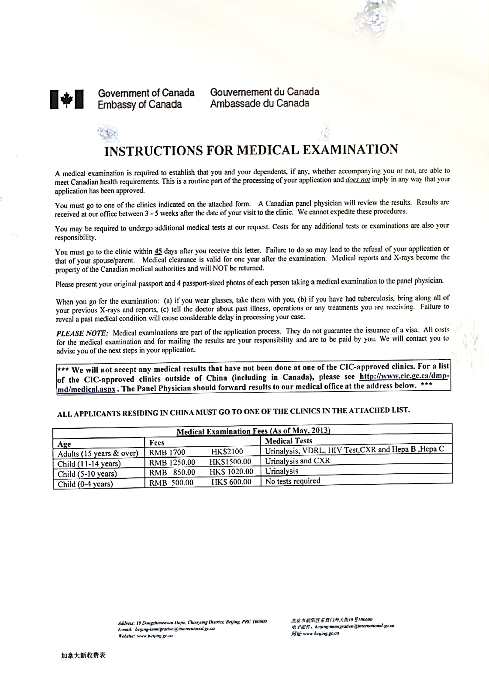

# 3.1体检

学签申请者需要体检，体检一年有效，

体检过程

* 需要到指定的机构进行体检，查询地址[https://secure.cic.gc.ca/pp-md/pp-list.aspx](https://secure.cic.gc.ca/pp-md/pp-list.aspx)
* 找到对应的体检机构预约，例如我预约的是[https://www.prioritymedi.com](https://www.prioritymedi.com)
* 资料提交后，他们会电话联系，提醒注意事项和具体的体检时间
* 带好护照、身份证、出生证明等等，只要具备一项即可，空腹指定地点进行体检
* 前台缴费，大概1700左右，不同的年龄段资费不同
* 体检完毕后，收到一个回执，大概两天左右他们会把结果上传到对应国家的移民局

注意：不需要携带任何登记照片或者数码回执，都是现场摄像头照相。15周岁以下，不需要抽血，费用未850人民币，请看如下表格

